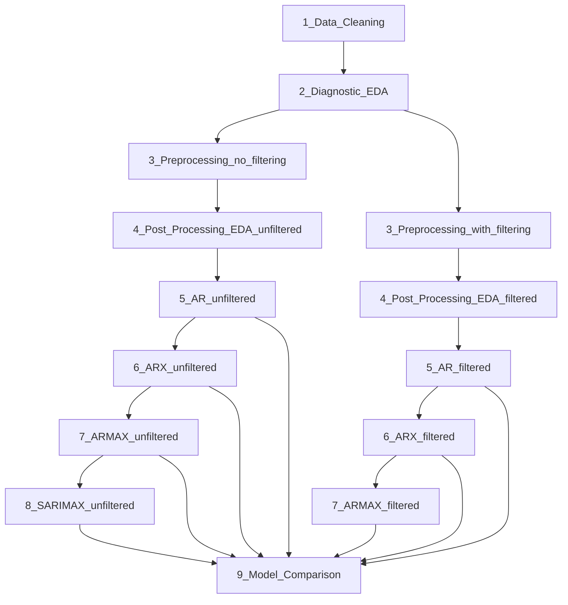

# PV Power Forecasting

Forecasting DC power output of a PV system from weather and air-quality data, using classical time-series models (AR → ARX → ARMAX → SARIMAX).

## Overview


*(Drop your overview picture here as `overview.png`, next to this README.)*

## Pipeline flow



## Notebooks

| # | Notebook | What it does |
|---|----------|---------------|
| 1 | `1_Data_Cleaning` | Loads raw data, strips column names, drops duplicates/empty columns, renames `PV_Total_Power_W` → `DC`, parses timestamps, fixes numeric types. Saves `cleaned_data.csv`. |
| 2 | `2_Diagnostic_EDA` | First look at the cleaned data: missingness, distributions, rough time-series shape. |
| 3 | `3_Preprocessing_no_filtering` | Recovers missing `DC` from PV1/PV2 voltage × current, KNN-imputes remaining gaps, keeps all hours. Saves `imputed_unfiltered_data.csv`. |
| 3 | `3_Preprocessing_with_filtering` | Same idea, but restricted to daytime hours (irregular gaps between rows). Saves `imputed_filtered_data.csv`. |
| 4 | `4_Post_Processing_EDA_unfiltered` / `_filtered` | Post-imputation EDA: correlations, rolling means, seasonal decomposition, ADF test, ACF/PACF. |
| 5 | `5_AR_unfiltered` / `_filtered` | Pure autoregressive model (`DC` on its own lags only), order chosen via AIC. |
| 6 | `6_ARX_unfiltered` / `_filtered` | Adds exogenous weather/air-quality regressors to the AR model. |
| 7 | `7_ARMAX_unfiltered` / `_filtered` | Adds a moving-average term on top of ARX (`SARIMAX` with `d=0`, no seasonality). |
| 8 | `8_SARIMAX_unfiltered` | Adds a seasonal term (`s=24`, daily cycle) on top of ARMAX. Grid-searches `(p,q,P,Q)` on AIC. |
| 9 | `9_Model_Comparison` | Pulls metrics from all of the above into one table + bar charts, picks the best model per dataset. |

Each modeling notebook (5–8) follows the same shape: load imputed data → pick exogenous columns (where relevant) → 70/20/10 train/test/validation split → check stationarity → grid-search order on AIC → fit → test-set forecast → diagnostics → rolling one-step forecast → evaluation metrics → validation forecast → save model.

## Results

| Model | Data | Order | AIC | BIC | Test MSE | Test MAE | Test MAPE-like | Test R² |
|-------|------|-------|-----|-----|----------|----------|-----------------|---------|
| AR | filtered | AR(50) | 26099.4 | 26393.4 | 3895.26 | 41.245 | 1.582 | 0.934 |
| AR | unfiltered | AR(50) | 46988.1 | 47315.9 | 1715.39 | 20.903 | 1.694 | 0.973 |
| ARX | filtered | ARX(46) | 24983.3 | 25283.0 | 3980.96 | 47.452 | 1.878 | 0.933 |
| ARX | unfiltered | ARX(50) | 45406.5 | 45765.8 | 2021.78 | 33.218 | 3.456 | 0.968 |
| ARMAX | filtered | — | — | — | — | — | — | not run yet |
| ARMAX | unfiltered | (1,0,3) | 46611.7 | 46674.8 | 4223.14 | 38.169 | 2.491 | 0.933 |
| SARIMAX | unfiltered | see `results/model_metrics.csv` | — | — | — | — | — | run `8_SARIMAX_unfiltered` to fill in |

Best so far: **AR (unfiltered)**, R² = 0.973, lowest test MSE and MAE of the group. Note AIC/BIC are only comparable *within* the same dataset — filtered and unfiltered use a different number of observations.

`9_Model_Comparison.ipynb` regenerates this table (and the bar charts) automatically from `results/model_metrics.csv`, so it stays current as new models are added — no need to hand-edit this file.

## Folder structure

```
data/     raw_data.csv, cleaned_data.csv, imputed_*_data.csv
models/   saved .pkl models (ar_, arx_, armax_, sarimax_ × filtered/unfiltered)
results/  model_metrics.csv (auto-appended by each modeling notebook)
figures/  saved EDA plots
notebooks/ this pipeline, notebooks 1-9
```

## Real-time inference note

The models are trained on hourly data (one row per `:00`). A live feed sampled every 3 minutes must be resampled to hourly before being passed to a model — feeding raw 3-minute points in breaks the lag structure and the SARIMAX seasonal period (`s=24`). Match whatever the training data represents (point sample at `:00` vs. hourly average) for both `DC` and every exogenous column, and only forecast once per closed hour.
